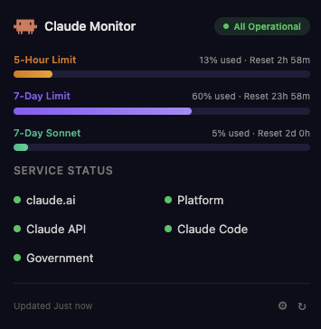
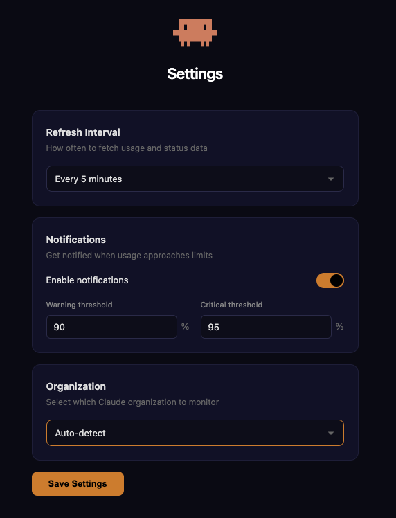

# Claude Monitor

> A Brave/Chrome extension that monitors your Claude usage limits and service status in real-time.

## Screenshots

  
  &nbsp;&nbsp;
  

## Features

- **Usage Limits** — Displays 5-hour, 7-day, 7-day Opus, and 7-day Sonnet utilization with progress bars and reset timers
- **Service Status** — Shows real-time status of all Claude services (claude.ai, API, Code, Platform, Government) from [status.claude.com](https://status.claude.com)
- **Auto Authentication** — Reads your session cookie from claude.ai automatically (just be logged in)
- **Notifications** — Customizable alerts when usage approaches limits (default: 80%, 95%)
- **Dark Mode UI** — Clean, dark-themed popup with color-coded progress bars
- **Configurable Refresh** — Adjustable polling interval (1-30 minutes, default: 5 min)

## Installation

1. Clone this repo or download as ZIP
2. Open `brave://extensions/` (or `chrome://extensions/`)
3. Enable **Developer mode** (toggle top-right)
4. Click **Load unpacked**
5. Select the `claude-monitor` folder

## Usage

1. Log in to [claude.ai](https://claude.ai) in your browser
2. Click the Claude Monitor icon in the toolbar
3. Your usage limits and service status appear automatically

## Settings

Right-click the extension icon > **Options** to configure:
- Refresh interval
- Notification thresholds
- Organization selector (if you have multiple)

## Tech Stack

- Vanilla JS, HTML, CSS — no dependencies
- Chrome Manifest V3
- APIs: `claude.ai/api/organizations/{orgId}/usage` + `status.claude.com/api/v2/summary.json`

## Inspired by

[usage4claude](https://github.com/f-is-h/usage4claude) — macOS menu bar app for Claude usage monitoring

## License

MIT
